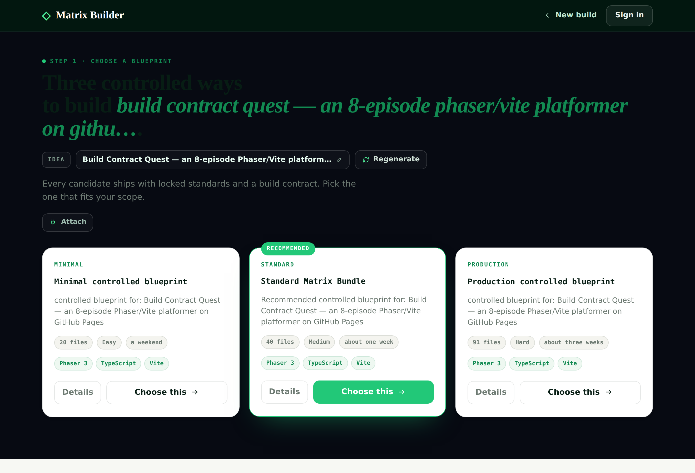
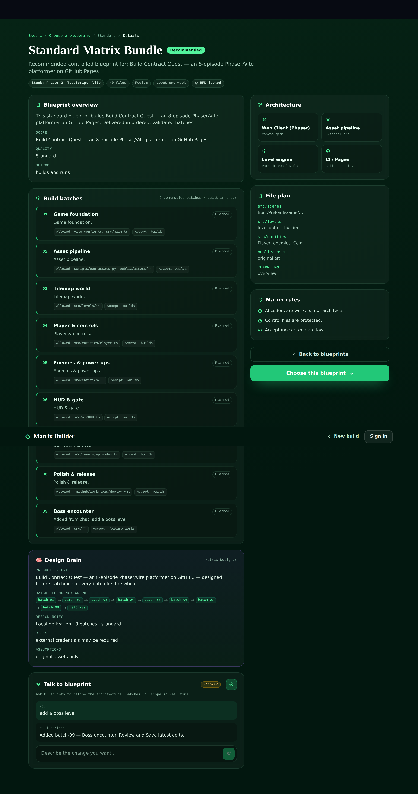

<div align="center">

<h1>🧠 Matrix Designer</h1>
<h3>The Brain of the Matrix ecosystem — <i>the batches guy</i>.</h3>

<p>Give it an idea and the <b>chosen blueprint</b>, and an <b>agentic LLM crew</b> designs the
<b>full proposal</b> — framework decision, visual/UX target, architecture, entity contracts, asset
manifest, acceptance criteria (including <i>visual</i>), and an ordered, dependency-aware
<b>batch roadmap with all details</b> — as one governed <b>Design Bundle</b>. Then
<a href="https://github.com/agent-matrix/matrix-builder">Matrix Builder</a> turns that brain into
controlled, validated batches and <a href="https://gitpilot.ruslanmv.com">GitPilot</a> builds them.</p>

<p>
  
  
  
  
  
</p>

</div>

---

## Why this exists

The hardest part of building a game or any project with AI is **not writing code** — it's
**knowing what the whole solution should become *before* splitting it into batches**. When there is
no authoritative design, every batch improvises: no art direction, no level architecture, no asset
plan, no entity system, no visual acceptance target, no batch ownership map. The result is a
primitive prototype, no matter how good the coder is.

**Matrix Designer is that missing brain.** It does **not** replace Matrix Builder — it prepares the
full design first, so when Matrix Builder mounts the puzzle, every piece fits.

```text
Matrix Designer designs the solution.
Matrix Builder controls the build.
GitPilot writes the code.
Matrix Definitions enforce the rules.
```

## Live in Matrix Builder

Matrix Designer is wired **end-to-end** into Matrix Builder's **Blueprint Details** page. Turn on the
quiet **Matrix Designer** toggle in *Settings → System Configuration* and each blueprint's **Details**
renders **real multi-agent output** — overview, architecture, build batches, file plan, Matrix rules,
a **Design Brain** panel, and a live **Talk to blueprint** chat that refines the plan.




Built and tested across both repos — batches `00`–`11` of the
[integration roadmap](docs/INTEGRATION_ROADMAP.md) (`09` dropped: provider-agnostic):

```
idea ─▶ Matrix Designer (LangGraph brain) ─▶ HTTP/MCP service ─▶ control-plane proxy
     ─▶ typed web client ─▶ Blueprint Details page    (deterministic fallback at every hop)
```

Every hop **fails open** to a deterministic derivation, so the page never blocks and the toggle-off
behaviour is unchanged. Saved blueprints + chat persist per build, owner-scoped (RLS).

## Where it fits in the pipeline

Matrix Builder's contract chain today is `idea-request → blueprint-candidate(×3) → matrix-bundle →
prompt-pack → validation`. Matrix Designer adds **one node and one artifact**, additively:

```text
idea-request ─▶ [ MATRIX DESIGNER ] ─▶ design-bundle ─▶ blueprint-candidate(×3) ─▶ matrix-bundle ─▶ prompt-pack ─▶ validation
                  (agentic crew)         (the brain)         (now derived from the brain via design_digest)
```

Nothing downstream changes. `idea-request` gains optional `references[]` + `design_mode`;
`blueprint-candidate` gains optional `design_bundle_ref` + `design_digest` so each blueprint is
**provably derived** from a signed design. See [`docs/INTEGRATION.md`](docs/INTEGRATION.md).

## The multi-agent brain (LangGraph) — designs the top-3 blueprints

A **LangGraph `StateGraph`** of specialist agents designs **three blueprints at once**
(Minimal → Standard → Production, simplest → hardest) and populates the full Blueprint
Details dashboard — with an **orchestrator chat** for live modifications. Each agent owns
one slice of the shared design state:

```
Planner → Requirements → Architect → UI/UX → Batch Planner → Quality → Synthesizer → 3 Blueprints
                                                   ↑__________ chat: "add a boss level" __________|
```

| Agent | Produces |
|---|---|
| **Planner / orchestrator** | domain, goals, coordination |
| **Requirements Analyst** | features, constraints, users, non-functional |
| **Architect** | components + dependencies for the stack |
| **UI/UX Designer** | flows + the asset/UI manifest (so *done* has a LOOK) |
| **Batch Planner** 🧩 | ordered, dependency-aware roadmap **per tier** — `allowed_files`, `acceptance` |
| **Quality Checker** | RMD + `DESIGN-*` governance (the brain can't approve itself) |
| **Blueprint Synthesizer** | the 3 candidate cards + full **BlueprintDetails** |

Full topology, state model and diagram: **[`docs/AGENTS.md`](docs/AGENTS.md)**.

```bash
mdesign blueprints --idea "Build a Phaser/Vite platformer on GitHub Pages"   # 3 blueprints + details
mdesign chat --idea "..." --message "add a boss level" --candidate standard  # orchestrator refinement
```

LangGraph is used when installed (`pip install "matrix-designer[langgraph]"`, durable state +
checkpointing); a **deterministic runner** executes the identical agents when no LLM is configured,
so CI and offline use never break. (A CrewAI back-end is also available behind the same
`DesignEngine` API via `MATRIX_DESIGNER_BACKEND=crewai`.)

> **AI proposes; Matrix Definitions enforce.** The Design Bundle is validated against design-packs
> (`GAME-001…010`, `APP-001…`) — the brain never approves itself.

## Quickstart

**With Make** (servers ready in three commands):

```bash
make install      # editable install + service & MCP extras
make test         # run the suite
make run          # HTTP service on :8077 (POST /design/blueprints, /design/refine, GET /healthz)
make run-mcp      # or the stdio MCP server
```

> **On Hugging Face:** Matrix Designer is installed and started **inside the Matrix Builder Space**
> automatically — one Space runs Matrix Builder + Matrix Designer together, ready to create projects
> and use GitPilot as the AI coder. See `matrix-builder/docs/deploy-huggingface.md`.

**With pip:**

```bash
pip install matrix-designer            # core (deterministic, offline)
pip install "matrix-designer[agentic,mcp]"   # + CrewAI crew + MCP server

# 1) Generate just the batches for a chosen blueprint (the batches guy)
mdesign batches --idea "An 8-episode arcade platformer for the web" \
                --blueprint blueprint.json --quality production

# 2) Or the full Design Bundle, validated
mdesign design  --idea "..." --blueprint blueprint.json -o design-bundle.json

# 3) Validate / export to Matrix Builder
mdesign validate design-bundle.json
mdesign export   design-bundle.json -o mb-export.json   # idea-request + blueprint overlay + mb next[]
```

### As a service (how Matrix Builder's control plane calls it)

```bash
pip install "matrix-designer[service]"
python -m matrix_designer.service           # FastAPI on :8077
#   POST /design/blueprints {idea}              -> 3 blueprints + details
#   POST /design/refine     {idea, message}     -> orchestrator chat refinement
#   GET  /healthz
```

watsonx-only: a non-approved provider is refused; with no provider the deterministic runner
answers, so the service never blocks and never calls an unapproved model.

### As an MCP server (how Matrix Builder calls it)

```bash
python -m matrix_designer.mcp_server        # stdio MCP server: matrix-designer
```

Tools: `analyze_idea · decompose_reference · propose_architecture · generate_batches ·
assemble_design_bundle · validate_design · export_to_builder`. In the Matrix Builder UI this is a
single quiet **“Design first”** toggle; the user still picks **Minimal / Standard / Production** —
but each candidate is now derived from the brain. See [`docs/MCP.md`](docs/MCP.md).

## The Design Bundle

The governed output artifact ([`schemas/design-bundle.schema.json`](schemas/design-bundle.schema.json)):
`goal_analysis · framework_decision · visual_target · architecture · contracts · asset_manifest ·
acceptance · batch_roadmap · governance · provenance` (content-addressed by `design_digest`).

A complete worked example — the brain that *would* have produced the premium Contract Quest instead
of the flat prototype — is in
[`examples/contract-quest/design-bundle.json`](examples/contract-quest/design-bundle.json).

## The ecosystem

| Project | Role |
|---|---|
| **Matrix Designer** | 🧠 the Brain — idea → governed Design Bundle (this repo) |
| **Matrix Builder** | the Contract Architect — bundle → batches → validate |
| **agent-generator** | the deterministic engine (blueprints, prompts, validation, repair) |
| **Matrix Definitions** | the Law — signed standards + design-packs |
| **GitPilot** | the Worker — a Matrix-native AI coder |
| **MatrixHub** | the Registry of validated bundles |

---

<div align="center"><sub>🧠 <b>Matrix Designer</b> · Created by <a href="https://ruslanmv.com">Ruslan Magana Vsevolodovna</a> · MIT licensed</sub></div>
