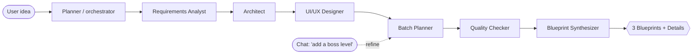

# Matrix Designer — the LangGraph multi-agent brain

Matrix Designer designs the **top-3 blueprints** (Minimal → Standard → Production,
simplest → hardest) and populates the full **Blueprint Details** dashboard (overview,
architecture, build batches, file plan, Matrix rules) — with an **orchestrator chat** for
live modifications. It is built as a **LangGraph `StateGraph`**: specialist agents each own
one slice of the design and write it into one shared state.

## Topology — Planner + Subagents (orchestrated pipeline, fan-out to 3 tiers)



The **Batch Planner** + **Synthesizer** fan out to three tiers in one pass (Minimal trims,
Production hardens), so a single run yields all three candidate cards and their details.

## The agents (LangGraph nodes — `agents.py`)

| Agent | Writes into state | Responsibility |
|---|---|---|
| **Planner / orchestrator** | `requirements.domain` | Interpret the idea, detect domain, coordinate the pipeline |
| **Requirements Analyst** | `requirements` | Features, constraints, users, non-functional needs |
| **Architect** | `architecture`, `_stack` | Components + dependencies for the chosen stack |
| **UI/UX Designer** | `ui_layout`, `asset_plan` | Flows + the asset/UI manifest (so *done* has a look) |
| **Batch Planner** | `details[tier]` | Ordered, dependency-aware roadmap per tier (the "batches guy") |
| **Quality Checker** | `matrix_rules`, `violations` | Governance — RMD + `DESIGN-*` design rules |
| **Blueprint Synthesizer** | `candidates`, `details` | Assemble the 3 BlueprintCandidate cards + full BlueprintDetails |

## State (`state.py`)

A `DesignState` TypedDict is the single design document every node reads/writes:
`idea · references · requirements · architecture · ui_layout · asset_plan · matrix_rules ·
candidates · details · chat_history · violations · log`. As a LangGraph state it supports
checkpointing and human-in-the-loop; as a plain dict it drives the deterministic fallback.

## Execution modes (same output contract)

- **LangGraph** (`MATRIX_DESIGNER_BACKEND=langgraph|auto`) — compiled `StateGraph` with a
  `MemorySaver` checkpointer; nodes may call the configured LLM (watsonx by default) via
  `agents.llm_assist` to enrich each draft.
- **Deterministic** — the identical nodes run in order with no LLM/network, so the brain
  always runs offline and in CI. The two are interchangeable.

## Orchestrator chat (human-in-the-loop)

`graph.refine(state, message, candidate_id)` applies a free-text modification and returns the
updated details + a reply:

- *"add a boss level" / "add audit logging" / "add analytics"* → appends a scoped batch.
- *"reduce scope" / "make it simpler"* → trims a batch.
- *"split batch 3"* → flags the planner to divide it on save.

The contract only changes when the user **saves** — matching the Details page's *Talk to
blueprint* composer.

## Governance — AI proposes, Matrix Definitions enforce

The **Quality Checker** runs before synthesis: every batch must be scoped (`allowed_files`
+ `acceptance`), dependencies must reference real batches, and game blueprints must carry a
visual acceptance target (`GAME-006`). Any `high`/`critical` violation blocks the design.
The brain never approves itself.

## MCP / CLI surface

```bash
mdesign blueprints --idea "..."                         # 3 blueprints + full details
mdesign chat --idea "..." --message "add a boss level"  # orchestrator refinement
python -m matrix_designer.mcp_server                     # MCP: generate_blueprints, refine_design, …
```

`generate_blueprints` / `refine_design` are the tools Matrix Builder calls to populate and
refine the Details page natively.
