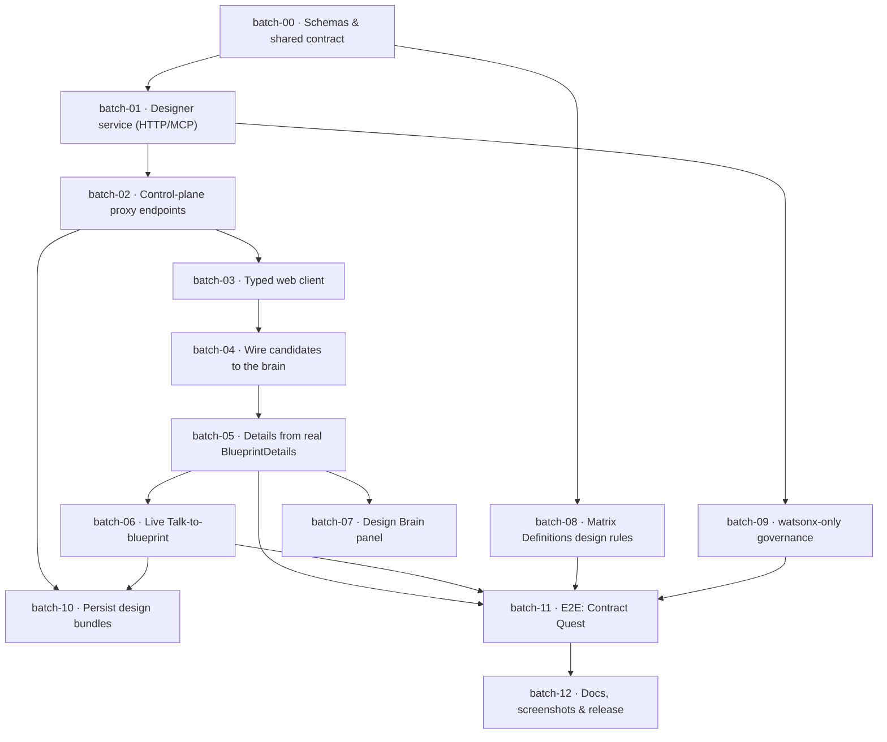

# Integration Roadmap — Matrix Designer ↔ Matrix Builder ↔ GitPilot

The governed batch plan to make the Blueprint Details page render **real** multi-agent
output and the Talk-to-blueprint chat call the **orchestrator** — opt-in behind the Matrix
Designer toggle, fail-closed, watsonx-only, with zero regression when it's off.

This roadmap *is* a Design Bundle:
[`examples/matrix-builder-integration/design-bundle.json`](../examples/matrix-builder-integration/design-bundle.json)
— it validates `approved` and exports a 13-step `mb next` sequence:

```bash
mdesign validate examples/matrix-builder-integration/design-bundle.json   # approved
mdesign export   examples/matrix-builder-integration/design-bundle.json    # idea-request + blueprint overlay + mb next[]
```

## Dependency graph



## Batches & acceptance

Status as of the integration build: **00–11 landed** (09 intentionally dropped — Matrix Designer is
provider-agnostic, see below); **12** is this doc + release.

| # | Batch | Touches | Status |
|---|---|---|---|
| **00** | **Schemas & shared contract** | `packages/contracts/schemas/*`, `schema-registry.json` | ✅ done |
| **01** | **Designer service (HTTP/MCP)** | `matrix_designer/service.py`, `mcp_server.py` | ✅ done |
| **02** | **Control-plane proxy endpoints** | `services/api/app/api/blueprints.py` | ✅ done |
| **03** | **Typed web client** | `apps/web/src/lib/blueprint-client.ts` | ✅ done |
| **04** | **Wire candidates to the brain** | `MatrixBuilderClient.tsx` | ✅ done |
| **05** | **Details from real BlueprintDetails** | `MatrixBuilderClient.tsx` | ✅ done |
| **06** | **Live Talk-to-blueprint** | `MatrixBuilderClient.tsx` | ✅ done |
| **07** | **Design Brain panel** | `MatrixBuilderClient.tsx` | ✅ done |
| **08** | **Matrix Definitions design rules** | `packs/**`, `docs/GOVERNANCE.md` | ✅ done |
| **09** | **watsonx-only governance** | — | ⏭️ dropped (provider-agnostic) |
| **10** | **Persist design bundles** | `workflow` + migration `0006` | ✅ done (RLS) |
| **11** | **E2E proof: Contract Quest** | `tests/e2e/*` | ✅ done |
| **12** | **Docs, screenshots & release** | this doc, `README.md`, `CHANGELOG.md` | ✅ done |

> **batch-09 dropped:** the ecosystem uses **OllaBridge / any LLM provider**, so Matrix Designer is
> provider-agnostic. The old watsonx-only guard is now an *optional* operator allow-list
> (`MATRIX_DESIGNER_ALLOWED_PROVIDERS`); unset = allow all.

> **batch-10 note:** the `design_bundles` table, endpoints (`/save`, `/saved`) and RLS are done and
> tested; the typed client is wired (`saveBlueprintDetails(buildId)`, `fetchSavedBlueprint`). The UI
> *auto-reload from server* rides on the broader localStorage→control-plane migration (matrix-builder
> TODO **P0**) and just needs a server-side build id to key on.

## Execution

Each batch is scoped to an allow-list and gated by `mb check` before it lands. Run them as
the `mb next` sequence the bundle exports, in dependency order. **batch-00, 04, 05, 06** are
the critical path that makes the Details page live; **08, 09** are the governance gates;
**11** is the end-to-end proof on Contract Quest.

> Status note: parts of **batch-00/01** already exist in `matrix-designer` (the schema, the
> LangGraph brain, `generate_blueprints` + `refine_design`), and the Details page UI + the
> Matrix Designer toggle already shipped in `matrix-builder`. This roadmap connects them.
