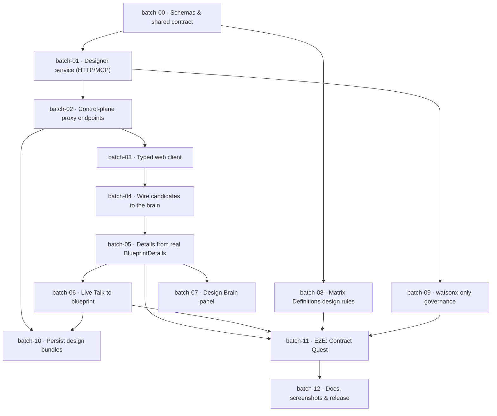

# Integration Roadmap — Matrix Designer ↔ Matrix Builder ↔ GitPilot

The governed batch plan to make the Blueprint Details page render **real** multi-agent
output and the Talk-to-blueprint chat call the **orchestrator** — opt-in behind the Matrix
Designer toggle, fail-closed, watsonx-only, with zero regression when it's off.

This roadmap *is* a Design Bundle:
[`examples/matrix-builder-integration/design-bundle.json`](../examples/matrix-builder-integration/design-bundle.json)
— it validates `approved` and exports a 13-step `mb next` sequence:

```bash
mdesign validate examples/matrix-builder-integration/design-bundle.json   # approved
mdesign export   examples/matrix-builder-integration/design-bundle.json    # idea-request + blueprint overlay + mb next[]
```

## Dependency graph



## Batches & acceptance

| # | Batch | Touches | Acceptance |
|---|---|---|---|
| **00** | **Schemas & shared contract** | `packages/contracts/schemas/*`, `schema-registry.json` | schemas validate the example bundle; registry lists both |
| **01** | **Designer service (HTTP/MCP)** | `matrix_designer/service.py`, `mcp_server.py` | returns 3 blueprints; watsonx-only; deterministic fallback |
| **02** | **Control-plane proxy endpoints** | `services/api/app/api/blueprints.py` | 4 endpoints return schema-valid payloads; never 500 on designer-down |
| **03** | **Typed web client** | `apps/web/src/lib/blueprint-client.ts` | typechecks; offline/off → local derivation |
| **04** | **Wire candidates to the brain** | `MatrixBuilderClient.tsx` | toggle ON → agent cards; OFF → unchanged |
| **05** | **Details from real BlueprintDetails** | `MatrixBuilderClient.tsx` | Details renders agent data; derivation is the fallback |
| **06** | **Live Talk-to-blueprint** | `MatrixBuilderClient.tsx` | "add a boss level" adds a batch; Save persists |
| **07** | **Design Brain panel** | `MatrixBuilderClient.tsx` | shows only when toggle on; content from the bundle |
| **08** | **Matrix Definitions design rules** | `packs/**`, `docs/GOVERNANCE.md` | unscoped batch rejected; game without visual acceptance → needs-repair |
| **09** | **watsonx-only governance** | `agents.py`, `service.py` | non-watsonx provider refused; no keys committed |
| **10** | **Persist design bundles** | `workflow_service.py`, migration `0005` | reopen build → same blueprint + chat; owner-scoped (RLS) |
| **11** | **E2E proof: Contract Quest** | `tests/e2e/*`, `examples/contract-quest/*` | design → mb-next → validated batches; game builds |
| **12** | **Docs, screenshots & release** | `README.md`, `docs/*`, `CHANGELOG.md` | docs build; before/after screenshots; release notes |

## Execution

Each batch is scoped to an allow-list and gated by `mb check` before it lands. Run them as
the `mb next` sequence the bundle exports, in dependency order. **batch-00, 04, 05, 06** are
the critical path that makes the Details page live; **08, 09** are the governance gates;
**11** is the end-to-end proof on Contract Quest.

> Status note: parts of **batch-00/01** already exist in `matrix-designer` (the schema, the
> LangGraph brain, `generate_blueprints` + `refine_design`), and the Details page UI + the
> Matrix Designer toggle already shipped in `matrix-builder`. This roadmap connects them.
